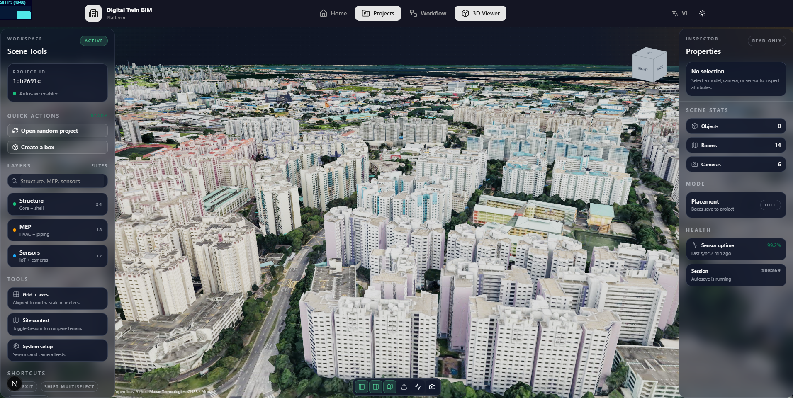

# prac-digital-bim

**Ascend Platform** - A comprehensive web application for building information modeling and digital twin management. Built with Next.js, React Three Fiber, and advanced 3D visualization capabilities.

Transform your building lifecycle management with integrated BIM workflows, real-time monitoring, and intelligent automation.

🌐 **Live Demo**: https://workflow-bim.vercel.app


## ✨ Features

- 🏗️ **BIM Model Visualization**: Import and visualize IFC files with complete building information
- 🗺️ **3D Geospatial Integration**: Combine BIM with GIS using Cesium for comprehensive spatial analysis
- 🔄 **Workflow Automation**: Drag-and-drop workflow builder with webhook integrations
- 📊 **Real-time Monitoring**: IoT sensor integration and live data visualization
- 🎨 **Modern UI**: Clean, responsive interface with dark/light theme support
- 🌍 **Multi-language**: English and Vietnamese language support

## 🖼️ Gallery

### 3D Map Integration
Advanced geospatial visualization combining BIM models with interactive 3D mapping powered by Cesium. Navigate through your building projects in their real-world geographic context with terrain, satellite imagery, and spatial analytics.



### Project UI
Desktop viewer to monitor BIM layers, assets, and live sensors within the project context. Manage multiple projects, track building components, and access detailed model information in an intuitive interface.


### Render IFC
High-quality IFC model rendering that showcases spatial relationships, building elements, and detailed annotations. Explore your building models with advanced visualization tools and material representations.


### Workflow Builder
Intuitive drag-and-drop workflow canvas for automation and system integration. Create custom workflows, connect external services via webhooks, and automate your BIM processes with visual programming.


## 🚀 Getting Started

### Requirements

- Node.js 18+ (recommended)
- npm / pnpm / yarn
- Modern web browser with WebGL support

### Installation

```bash
# Install dependencies
pnpm install

# or using npm
npm install
```

### Development

```bash
# Start development server
pnpm dev

# Build for production
pnpm build

# Analyze bundle size
pnpm build:analyze

# Start production server
pnpm start
```

Open `http://localhost:3000` to view the application.

## 📦 Tech Stack

- **Framework**: Next.js 16 with Turbopack
- **3D Graphics**: React Three Fiber, Three.js
- **BIM Processing**: @thatopen/components, web-ifc
- **Geospatial**: Cesium.js for 3D mapping
- **UI Components**: Radix UI, Tailwind CSS
- **Workflow Engine**: React Flow (@xyflow/react)
- **State Management**: React Signals
- **Video Streaming**: HLS.js for RTSP streams

## 📝 Main Scripts

- `pnpm dev` - Start development server with hot reload
- `pnpm build` - Build for production with size analysis
- `pnpm build:analyze` - Build with detailed bundle analyzer
- `pnpm start` - Run production server
- `pnpm lint` - Run ESLint checks

## 🏗️ Architecture

This Ascend platform integrates multiple technologies:

- **IFC File Processing**: Import and parse Industry Foundation Classes (IFC) files
- **3D Visualization**: Real-time rendering of building models with Three.js
- **Geospatial Context**: Cesium integration for geographic positioning
- **Workflow Automation**: Node-based visual programming for BIM workflows
- **IoT Integration**: Real-time sensor data streaming and monitoring
- **API Integration**: Webhook support for external system connections

## 📚 Resources

### IFC & BIM
- IFC Processing: https://thatopen.com
- IFC Specification: https://www.buildingsmart.org

### Inspiration & References
- UI Design inspired by IFCflow: https://www.ifcflow.com/
- Cesium for Geospatial: https://cesium.com

## 🤝 Contributing

Contributions are welcome! This project is designed for architects, engineers, and developers working with BIM and digital twin technologies.

## 📄 License

Released under the **GNU Affero General Public License v3.0 (AGPLv3)**.
See [LICENSE](LICENSE) for details.

---

**Built with ❤️ for the AEC industry**
