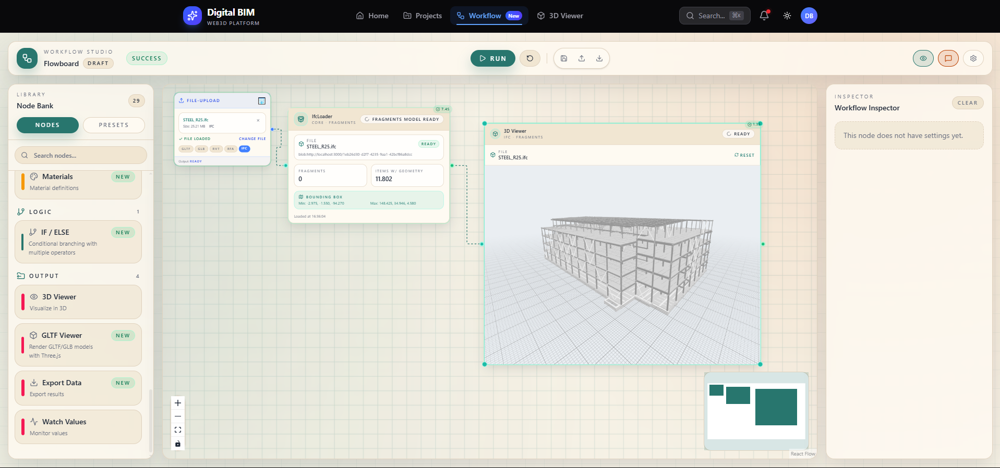
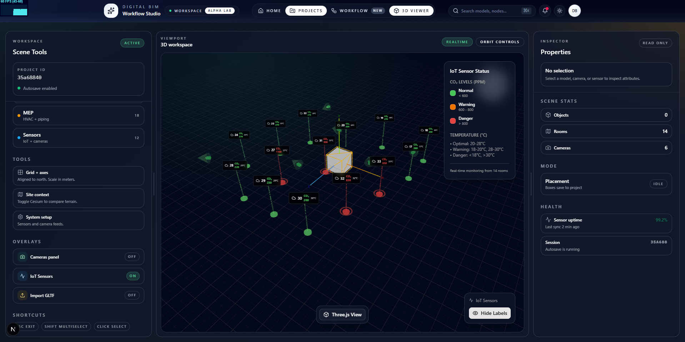
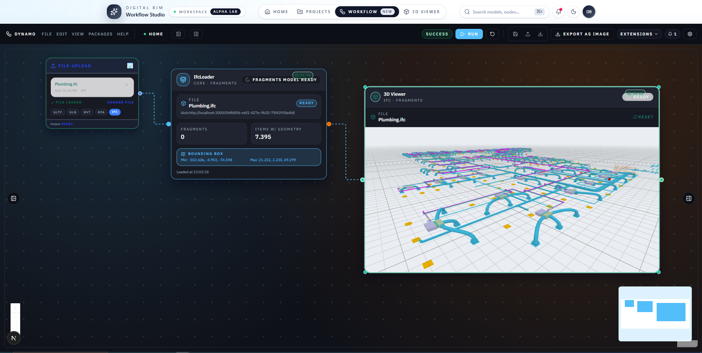
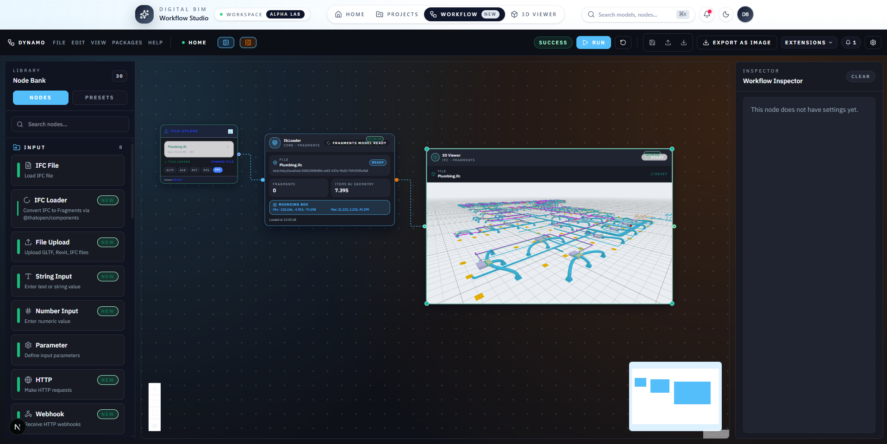

# prac-digital-bim

Web application for BIM workflows, built with Next.js. This project references IFC classification materials to support presentation and lookup.
Designed for architects and engineers who need a polished interface for managing IFC models and connected workflows.
Go to my project: https://prac-digital-9esyno29t-nguyenngocdues-projects.vercel.app



## Gallery

### Project UI
Desktop viewer to monitor BIM layers, assets, and live sensors within the project context.


### Render IFC
Photorealistic IFC render that shows spatial relationships and annotations for the scene.


### Workflow
Drag‑and‑drop workflow canvas that keeps automation steps and integrations neatly organized.


## Requirements

- Node.js 18+ (recommended)
- npm / pnpm / yarn

## Install

```bash
npm install
```

## Run dev

```bash
npm run dev
```

Open `http://localhost:3000` to view the app.

## Main scripts

- `npm run dev`: start dev server
- `npm run build`: build production
- `npm run start`: run production server
- `npm run lint`: run lint checks

## References

- IFC classify: https://www.ifcclassify.com

## Inspiration

Inspired by the UI of IFCflow: https://www.ifcflow.com/

## License

Released under the GNU Affero General Public License v3.0 (AGPLv3).
See `LICENSE`.
